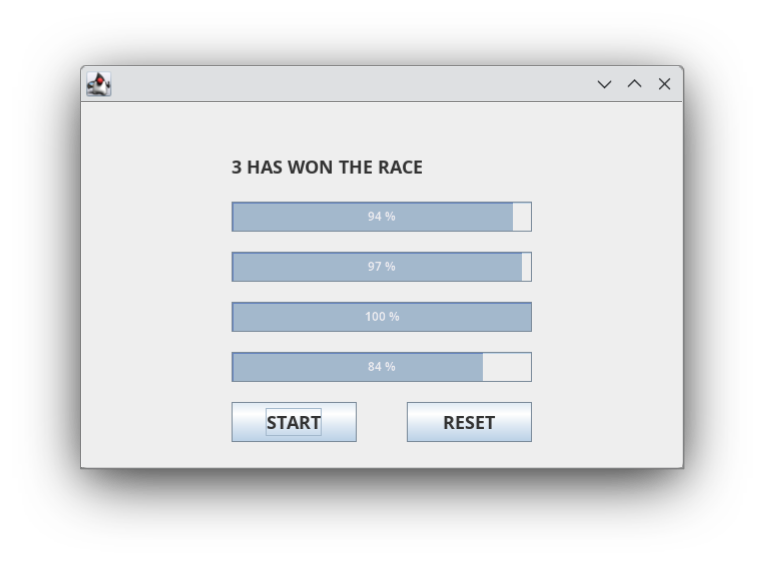

# Horse Race

This Java program simulates a horse race using threads. Each horse is represented as a thread, and they compete to reach the finish line.

## Table of Contents

- [Features](#features)
- [Getting Started](#getting-started)
- [Contributing](#contributing)
- [License](#license)

## Features

- Start a race.
- Reset and restart all the times you want.

## Getting Started

To use Horse Race follow these steps:

1. Clone this repository: `git clone https://github.com/enriqueseor/horse-race.git`
2. Open the project in IntelliJ or similar IDE.
3. Build and run the app.

## License

This project is licensed under the [MIT License](LICENSE).